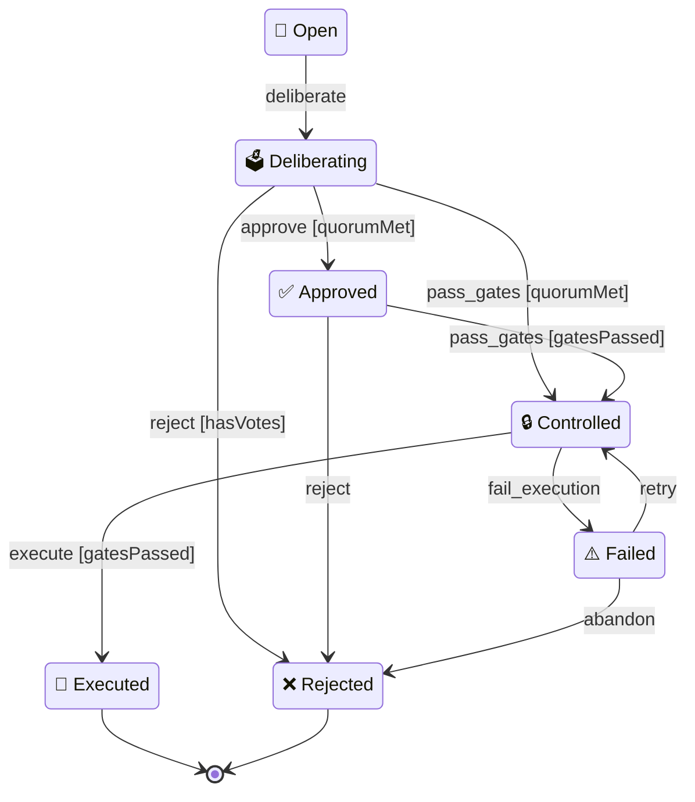

# Proposal State Machine

Auto-generated from the XState v5 FSM in `core/machine.ts`.



## Transition Table

| From | Event | To | Guard |
|------|-------|----|-------|
| open | deliberate | deliberating | — |
| deliberating | approve | approved | quorumMet |
| deliberating | reject | rejected | hasVotes |
| deliberating | pass_gates | controlled | quorumMet |
| approved | pass_gates | controlled | gatesPassed |
| approved | reject | rejected | — |
| controlled | execute | executed | gatesPassed |
| controlled | fail_execution | failed | — |
| failed | retry | controlled | — |
| failed | abandon | rejected | — |

## Terminal States

- `executed` — proposal successfully delivered → `[*]`
- `rejected` — proposal denied or abandoned → `[*]`

## Guards

| Guard | Description | Used By |
|-------|-------------|---------|
| `quorumMet` | `event.quorumMet === true` — quorum reached | deliberating→approve, deliberating→pass_gates |
| `gatesPassed` | `event.gatesPassed === true` — all gates passed | approved→pass_gates, controlled→execute |
| `hasVotes` | `event.hasVotes === true` — votes have been cast | deliberating→reject |

## Architecture (FC&IS)

```
core/machine.ts            ← XState v5 proposal machine (source of truth)
core/states.ts             ← Legacy transition table + guard types (kept for compat)
core/evaluate.ts           ← evaluateTransition(), getAllowedTransitions() (pure functions)
core/diagram.ts            ← Mermaid diagram export from machine data (pure function)
shell/hooks.ts             ← onTransition() hook registry (side effects)
shell/lifecycle-manager.ts ← transitionProposal() (side effects + persistence)
shell/amendment-sync.ts    ← AmendmentState sync hooks (best-effort)
governance/lifecycle.ts    ← Facade (backward compatible API)
```

## Events

| Event | Trigger |
|-------|---------|
| `deliberate` | Swarm starts deliberation on a proposal |
| `approve` | Tally shows quorum + approval threshold met |
| `reject` | Tally shows quorum not met or below threshold (requires `hasVotes`) |
| `pass_gates` | `dao_check` returns all control gates passed |
| `fail_gates` | Control gates fail (unused — transitions not defined in machine) |
| `execute` | `dao_execute` completes successfully |
| `fail_execution` | `dao_execute` encounters error |
| `retry` | Retry from failed state back to controlled |
| `abandon` | Abandon a failed proposal → rejected (final) |
