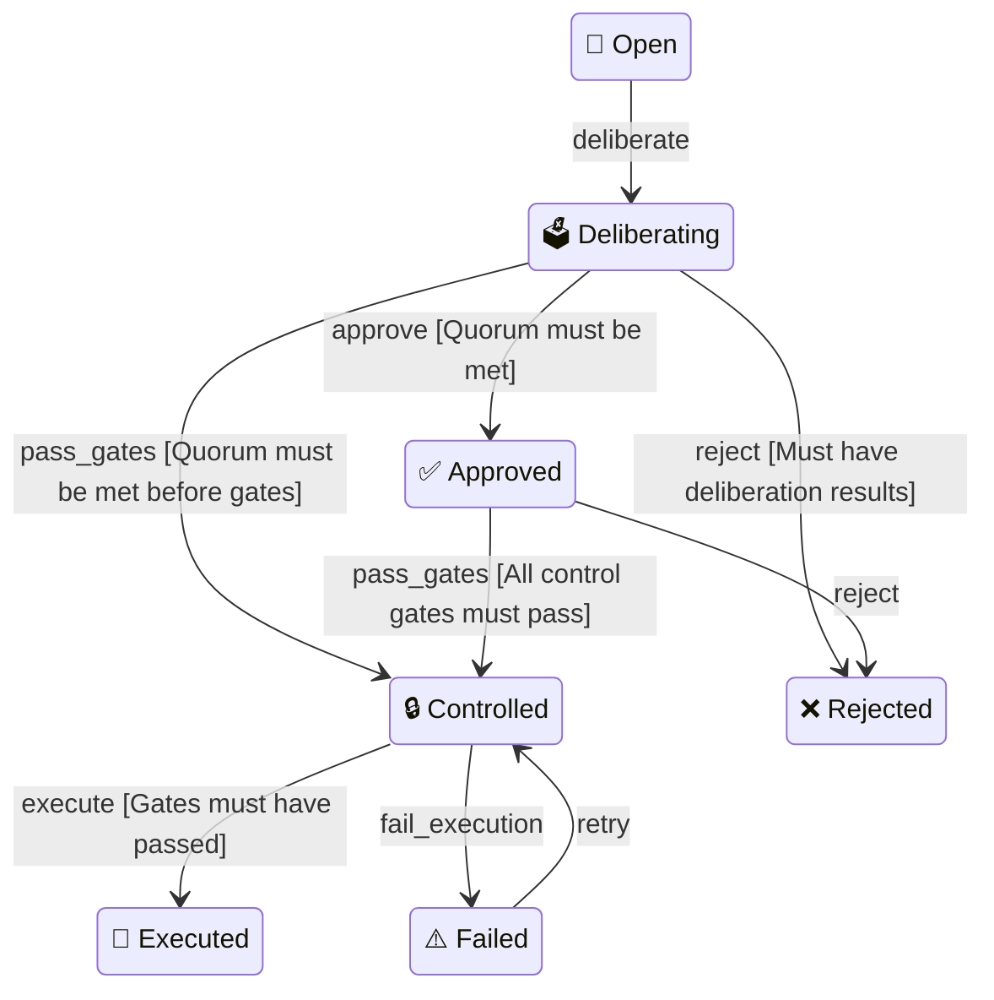

# Proposal State Machine

Auto-generated from the formal FSM in `core/states.ts`.



## Transition Table

| From | Event | To | Guard |
|------|-------|----|-------|
| open | deliberate | deliberating | — |
| deliberating | approve | approved | Quorum met |
| deliberating | reject | rejected | Has deliberation results |
| deliberating | pass_gates | controlled | Quorum met |
| approved | pass_gates | controlled | All gates passed |
| approved | reject | rejected | — |
| controlled | execute | executed | Gates passed |
| controlled | fail_execution | failed | — |
| failed | retry | controlled | — |

## Terminal States
- `executed` — proposal successfully delivered
- `rejected` — proposal denied

## Architecture (FC&IS)

```
core/states.ts       ← Transition table + guard types (pure data)
core/evaluate.ts     ← evaluateTransition(), getAllowedTransitions() (pure functions)
core/diagram.ts      ← Mermaid diagram export (pure function)
shell/hooks.ts       ← onTransition() hook registry (side effects)
shell/lifecycle-manager.ts ← transitionProposal() (side effects + persistence)
governance/lifecycle.ts    ← Facade (backward compatible API)
```

## Events

| Event | Trigger |
|-------|---------|
| `deliberate` | `dao_deliberate` called |
| `approve` | Tally shows quorum + approval met |
| `reject` | Tally shows quorum not met or approval below threshold |
| `pass_gates` | `dao_check` returns all gates passed |
| `fail_execution` | `dao_execute` encounters error |
| `execute` | `dao_execute` completes successfully |
| `retry` | Retry from failed state |
| `archive` | Archive a terminal proposal |
